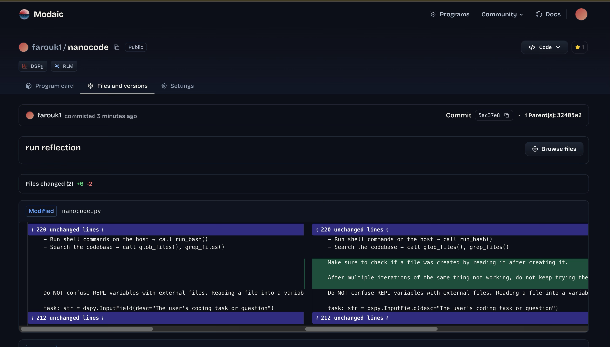

# Terminal Bench

A self-improving AI coding agent benchmark system. Runs microcode against terminal-bench tasks, monitors failures, and automatically iterates on the agent's prompt based on failure analysis.

## Overview

I created a closed-loop feedback loop around Terminal Bench to create a system where:

1. **Microcode** runs coding tasks via Harbor benchmark infrastructure
2. **Failed trajectories** are collected and analyzed
3. **Feedback** is generated identifying common failure patterns
4. **The agent's prompt** (dspy Signature) is automatically updated based on feedback
5. **New revisions** are pushed to Modaic hub and automatically propagate to running agents

```
┌─────────────────────────────────────────────────────────────────────┐
│                         FEEDBACK LOOP                               │
│                                                                     │
│   ┌──────────┐    ┌──────────┐    ┌──────────┐    ┌──────────┐     │
│   │  Run     │    │ Collect  │    │ Generate │    │ Update   │     │
│   │  Tasks   │───▶│ Failures │───▶│ Feedback │───▶│ Signature│──┐  │
│   └──────────┘    └──────────┘    └──────────┘    └──────────┘  │  │
│        ▲                                                         │  │
│        │                        ┌──────────┐                     │  │
│        └────────────────────────│ Push to  │◀────────────────────┘  │
│                                 │   Hub    │                        │
│                                 └──────────┘                        │
└─────────────────────────────────────────────────────────────────────┘
```




## Project Structure

```
terminal-bench/
├── agent.py              # Harbor agent wrapper for microcode CLI
├── reflect.py            # Monitoring + feedback loop orchestration
├── Makefile              # Common commands
├── templates/
│   └── install_microcode.sh.j2   # Container installation script
└── nanocode/
    └── nanocode.py       # RLM engine with CodingAssistant signature
```

## Components

### `agent.py` - Harbor Agent

Wraps the microcode CLI as a Harbor installed agent for benchmark execution. Configures:
- LM models (main + sub-LM for code execution)
- Iteration limits and token budgets
- Tracing via Weights & Biases

### `reflect.py` - Feedback Loop Monitor

Continuously monitors benchmark jobs for failures and orchestrates the self-improvement loop:

1. **Scan** `jobs/{job_id}/{task_id}/` for failed tasks (`reward.txt == 0`)
2. **Copy** trajectories and test results to `failed-jobs/`
3. **At every 10 failures**, run microcode to analyze patterns → `FEEDBACK.md`
4. **Iterate** on `CodingAssistant` signature based on feedback
5. **Push** updated nanocode to Modaic hub

### `nanocode/nanocode.py` - RLM Engine

The core RLM engine implementation using DSPy's RLM (Reasoning Language Model). Modaic packages this program and exposes it in one line of code @ [farouk1/nanocode](https://modaic.dev/farouk1/nanocode). Full Microcode CLI is @ [modaic-ai/microcode](https://github.com/modaic-ai/microcode).

- **`CodingAssistant`** - dspy.Signature defining the agent's behavior/prompt
- **`RLMCodingProgram`** - PrecompiledProgram that executes tasks with tool access
- **Tools**: `read_file`, `write_file`, `edit_file`, `glob_files`, `grep_files`, `run_bash`

The signature is what gets iterated on during the feedback loop.

## Usage

### Prerequisites

```bash
# Install dependencies
uv sync

# Required environment variables
export OPENROUTER_API_KEY="your-key"
export WANDB_API_KEY="your-key"        # Optional, for tracing
export WANDB_PROJECT="your-project"    # Optional, for tracing
export MODAIC_TOKEN="your-key"         # For sending new versions to Modaic hub
```

### Commands

```bash
# Run benchmark with parallel reflection monitoring
make run-parallel

# Run benchmark only (no reflection)
make run

# Run single sample task
make sample

# Run reflection monitor only
make reflect

# Run reflection once and exit
make reflect-once

# Clear all job artifacts
make clear-jobs

# List completed jobs
make ls-cj
```

### Manual Execution

```bash
# Run the benchmark via Harbor
harbor run -d "terminal-bench@2.0" --agent-import-path agent:MicrocodeInstalledAgent

# Run reflection monitor
python reflect.py

# Run reflection once
python reflect.py --one-shot

# Custom poll interval
python reflect.py --poll-interval 30

# Reset processed jobs tracker
python reflect.py --reset-processed
```

## How the Feedback Loop Works

### 1. Failure Detection

The monitor scans `jobs/` for completed tasks where `reward.txt == 0` (failed tests). It extracts:
- Agent trajectory (`stdout.txt`)
- Test results (`test-stdout.txt`)

### 2. Feedback Generation (every 10 failures)

Microcode analyzes the failed trajectories:

```
Explore the trajectories in failed-jobs/{job_id}. Each task contains
test results and agent trajectories. Formulate comprehensive feedback
and common failure modes.
```

Output: `failed-jobs/{job_id}/FEEDBACK.md`

### 3. Signature Iteration

Microcode reads the feedback and updates `nanocode/nanocode.py`:

```python
class CodingAssistant(dspy.Signature):
    """[This docstring gets updated based on failure patterns]"""

    task: str = dspy.InputField(desc="...")  # Can be updated
    answer: str = dspy.OutputField(desc="...")  # Can be updated
```

### 4. Hub Push

```bash
cd nanocode && uv run nanocode.py
```

This pushes to `farouk1/nanocode` on Modaic hub. Running microcode instances automatically pull the latest revision.

## Configuration

### Agent Configuration (`agent.py`)

| Parameter | Default | Description |
|-----------|---------|-------------|
| `lm` | `anthropic/claude-opus-4.5` | Main reasoning model |
| `sub_lm` | `qwen/qwen3-coder` | Code execution model |
| `max_iterations` | `50` | Max reasoning steps |
| `max_tokens` | `50000` | Token budget |
| `timeout_sec` | `1200` | Task timeout (20 min) |

### RLM Configuration (`nanocode/nanocode.py`)

| Parameter | Default | Description |
|-----------|---------|-------------|
| `max_iters` | `50` | Max iterations |
| `lm` | `openrouter/anthropic/claude-opus-4.5` | Main LM |
| `sub_lm` | `openrouter/qwen/qwen-coder` | Sub LM |
| `max_tokens` | `50000` | Max tokens per request |
| `max_output_chars` | `100000` | Max output size |

## License

MIT
